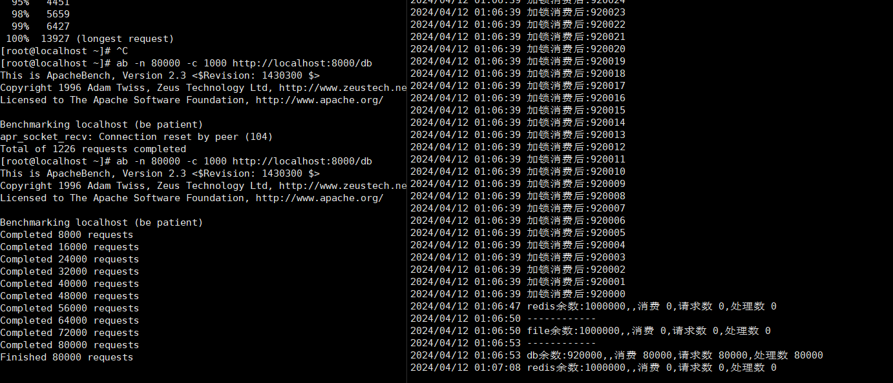

# rwlock
分布式锁,Leader Election


# rwlock

## Installation

To install rwlock, simply run:

    go get github.com/J-guanghua/rwlock

To compile it from source:

    cd $GOPATH/src/github.com/J-guanghua/rwlock
    go get -u -v
    go build && go test -v
### 
```go
    import (
        "github.com/J-guanghua/rwlock"
        "github.com/J-guanghua/rwlock/file"
        "github.com/J-guanghua/rwlock/redis"
        "github.com/J-guanghua/rwlock/database"
    )

    // init file lock
	// 压测 100万并发 左右
    Init("./tmp")
    mutex := file.Mutex("test-1")
    if err := mutex.Lock(ctx); err != nil {
        panic(err)
    }
    defer mutex.Unlock(ctx)
	
    // init redis lock 
    // 支持高可用,多实例，压测 100万并发 左右 
    redis.Init(&redis.Options{
        Addr:         "127.0.0.1:6379",
        PoolSize:     20,               // 连接池大小
        MinIdleConns: 10,               // 最小空闲连接数
        MaxConnAge:   time.Hour,        // 连接的最大生命周期
        PoolTimeout:  30 * time.Second, // 获取连接的超时时间
        IdleTimeout:  10 * time.Minute, // 连接的最大空闲时间
    })
    
    mutex := redis.Mutex("test-1")
    if err := mutex.Lock(ctx); err != nil {
        panic(err)
    }
    defer mutex.Unlock(ctx)
	
    // init db lock
	// 支持高可用,多实例，单实例并发压测 100000 左右
    db, err := sql.Open("mysql", "root:guanghua@tcp(192.168.43.152:3306)/sys?parseTime=true")
    if err != nil {
        panic(err)
    }
    database.Init(db)
    mutex := database.Mutex("test-1")
    if err := mutex.Lock(ctx); err != nil {
        panic(err)
    }
    defer mutex.Unlock(ctx)
        
```
// redis单机 ab 20万并发请求压测
ab -n 200000 -c 1000 http://localhost:8000/redis


// mysql单实例 ab 8万并发请求压测
ab -n 80000 -c 1000 http://localhost:8000/db

### Leader Election
```go

func TestLeaderElection(t *testing.T) {
    StartElection(context.TODO())
}

func StartElection(ctx context.Context) {
	// redis 实现
	leaderelection.RedisElectionRunOrDie(ctx, "redis-test", leaderelection.LeaderElectionConfig{
        OnStoppedLeading: func(identityID string) {
            log.Printf("我退出了,身份ID: %v", identityID)
			// 重新参与选举
            StartElection(ctx)
        },
        OnNewLeader: func(identityID string) {
            log.Printf("我当选了,身份ID: %v", identityID)
        },
        OnStartedLeading: func(ctx context.Context) {
            for {
                select {
                case <-ctx.Done():
                    return
                case <-time.After(2 * time.Second):
                    log.Printf("我在的..................")
                }
            }
        },
    })
}	

// 数据库 实现
leaderelection.MysqlElectionRunOrDie(ctx, "mysql-test", leaderelection.LeaderElectionConfig{
    OnStoppedLeading: func(identityID string) {
        log.Printf("我退出了,身份ID: %v", identityID)
    },
    OnNewLeader: func(identityID string) {
        log.Printf("我当选了,身份ID: %v", identityID)
    },
    OnStartedLeading: func(ctx context.Context) {
        for {
            select {
            case <-ctx.Done():
                return
            case <-time.After(2 * time.Second):
                log.Printf("我在的..................")
            }
        }
    },
})

```
